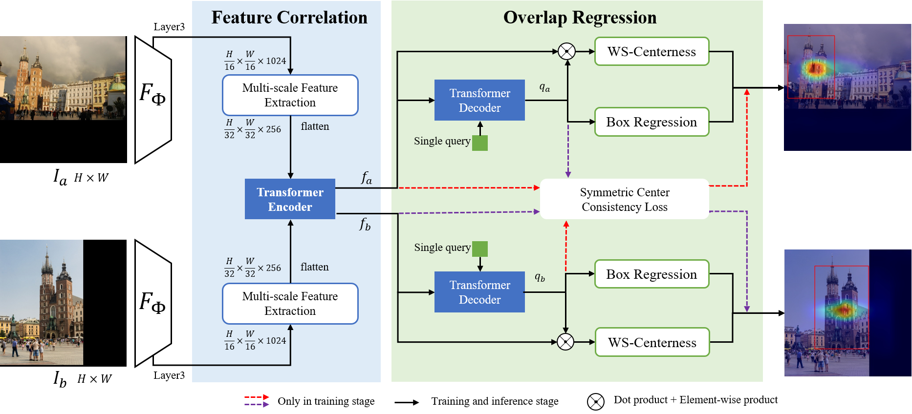

# Guide Local Feature Matching by Overlap Estimation

> update: Since our code open source requires review and related patent support, we need to complete the application for the relevant process. After completing the submission of eccv2022, we will go all out to complete the various processes required for open source, and it is expected that the open source will be completed around April 1. Thank you.
> arxiv link: https://arxiv.org/abs/2202.09050

We introduce OETR, a neural network for overlap area estimation of image pairs, accepted by AAAI-2022. We are completing a series of code integration for image registration, including a series of feature point extraction and matching methods. We will incorporate the OETR algorithm into this code framework, and it is expected that the open source will be completed before March 1, 2022.

<p align="center">
  </a>
</p>

## Abstract
Local image feature matching under large appearance, viewpoint, and distance changes is challenging yet important. Conventional methods detect and match tentative local features across the whole images, with heuristic consistency checks to guarantee reliable matches. In this paper, we introduce a novel Overlap Estimation method conditioned on image pairs with TRansformer, named OETR, to constrain local feature matching in the commonly visible region. OETR performs overlap estimation in a two-step process of feature correlation and then overlap regression. As a preprocessing module, OETR can be plugged into any existing local feature detection and matching pipeline, to mitigate potential view angle or scale variance. Intensive experiments show that OETR can boost state-of-the-art local feature matching performance substantially, especially for image pairs with small shared regions. 


## Datasets

### Validation on Megadepth
As we split megadepth 
As we split MegaDepth test set (with 10 scenes) into subsets according to the overlap scale ratio for image pairs. We separate overlap scales into $[1, 2), [2, 3), [3, 4), [4, +\infty)$ and combine $[2, 3), [3, 4), [4, +\infty)$ as $[2, +\infty)$ for image pairs with noticeable scale difference. All datasets are in assests folder.


## BibTex Citation

Please consider citing our work if you use any of the ideas presented the paper or code from this repo:

```
@inproceedings{chen2022guide,
  title={Guide Local Feature Matching by Overlap Estimation},
  author={Chen, Ying and Huang, Dihe and Xu, Shang and Liu, Jianlin and Liu, Yong},
  booktitle={AAAI}},
  year={2022}
}
```

